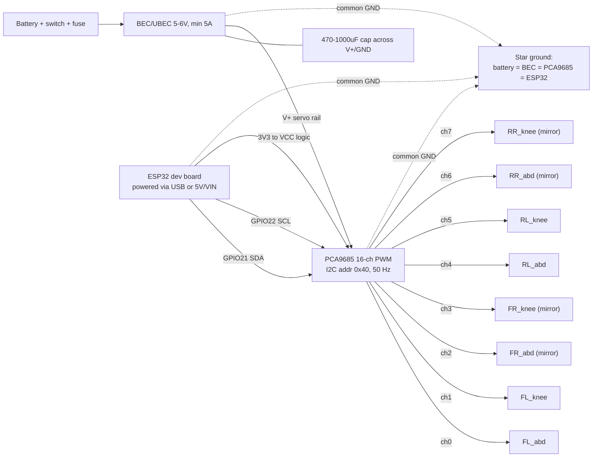
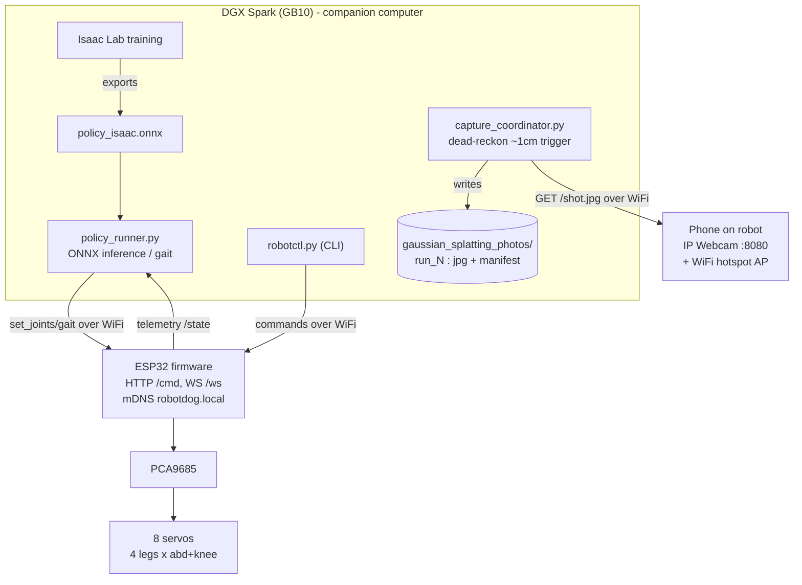

# Robot Dog — ESP32-controlled quadruped with an Isaac Lab walking policy

A 12-DOF quadruped ("robot dog") you can drive from a CLI / HTTP endpoints over
WiFi or BLE, with a locomotion policy trained in simulation, plus a camera-trigger
that signals an external service to take a photo on the robot's behalf.

> The original `robot/RobotDogUpdt.f3d` is an **Autodesk Fusion 360** archive
> (proprietary binary B-Rep; Fusion does not run on Linux). The robot model here
> is a **fresh parametric URDF/MJCF** re-derived from scratch — see `model/`.

## Layout

| Dir | What |
|-----|------|
| `model/` | `params.yaml` (single source of truth) → `generate.py` emits `robot_dog.urdf`, `robot_dog.xml` (MJCF), `servo_map.json`, and `firmware/src/servo_config.h`. One leg is defined once and replicated ×4. |
| `sim/` | `test_servo_map.py` (angle↔PWM round-trip), `view_mujoco.py` (kinematics check / render), `walk_demo.py` (open-loop trot gait — proves locomotion). |
| `firmware/` | ESP32 PlatformIO project: PCA9685 servo driver, WiFi (HTTP+WebSocket) + BLE control, shared JSON protocol, watchdog + E-STOP. `README_WIRING.md` = full wiring guide. |
| `control/` | `runtime/` (protocol, WiFi/BLE transports, servo math, camera trigger, policy runner) + `cli/robotctl.py` + `mock_esp32.py` (hardware-free test server). |
| `training/` | `isaaclab_task/` (Isaac Lab velocity-locomotion task for the GB10), `mujoco_fallback/` (runnable PPO), `export_policy.py`, `remote/` (GB10 setup/sync/train scripts). |
| `policy/` | Exported `policy.onnx` + `policy_meta.json` (obs/action contract). |
| `docs/` | `command_protocol.md`, `architecture.md`, `sim2real.md`, `isaac_lab_gb10.md`. |

## Circuit (wiring)

8-DOF build: an **ESP32** drives **8 servos** through a **PCA9685** over I²C. Servos
are powered from a dedicated BEC (never from the ESP32). Right-side legs (FR, RR) are
mirror-mounted — handled in `servo_map.json` (`direction = -1`), not in wiring.



## Architecture (control + data flow)

The policy/gait runs on a **companion computer (DGX Spark)**, not the ESP32. Commands
go over **WiFi** to the ESP32; for scan runs the DGX also pulls photos from a phone
(IP Webcam) into `gaussian_splatting_photos/run_N/`.



## Quickstart (no hardware needed)

```bash
python3 -m venv .venv && . .venv/bin/activate
pip install mujoco numpy pyyaml requests websockets aiohttp bleak \
            stable-baselines3 onnx onnxruntime onnxscript pillow

python model/generate.py            # build URDF/MJCF/servo_map/servo_config.h
python sim/test_servo_map.py        # validate servo calibration round-trips
python sim/view_mujoco.py --check   # validate kinematics
python sim/walk_demo.py             # open-loop trot — robot walks forward

# drive a simulated robot end-to-end:
python control/mock_esp32.py 8770 &                       # fake ESP32
python control/cli/robotctl.py --host 127.0.0.1 --port 8770 stand
python control/cli/robotctl.py --host 127.0.0.1 --port 8770 walk --speed 0.6
```

## On real hardware

1. Wire per `firmware/README_WIRING.md` (ESP32 + PCA9685 + 12 servos + BEC).
2. Set WiFi creds in `firmware/src/config.h`, then `cd firmware && pio run -t upload`.
3. Control: `robotctl --host <robot-ip> stand` (HTTP), `--ws` (WebSocket), or `--ble`.
   The robot also raises its own AP `robotdog`/`walkies123` if it can't join WiFi.

## Control interfaces

- **CLI**: `control/cli/robotctl.py` — `stand`, `stop`, `estop`, `walk`, `gait`,
  `set-joint`, `joints`, `photo`, `state`. Transports: HTTP (default), `--ws`, `--ble`.
- **HTTP endpoints** (served by the ESP32): `POST /cmd` (JSON envelope), `GET /state`.
- **WebSocket** `/ws` — for 50 Hz joint streaming (the policy runner).
- See `docs/command_protocol.md` for the exact schema.

## Learning to walk

- **Primary (GPU):** Isaac Lab task on the NVIDIA GB10 — `training/isaaclab_task/`,
  driven by `training/remote/{setup_gb10,sync,train}.sh`. See `docs/isaac_lab_gb10.md`.
- **Fallback (CPU/anywhere):** `training/mujoco_fallback/train_ppo.py` — same
  obs/action layout, so policies are interchangeable.
- Deploy: `training/export_policy.py` → `policy/policy.onnx`, then
  `control/runtime/policy_runner.py --sim` (closed-loop in MuJoCo) or
  `--robot <ip>` (stream to the ESP32). The policy runs on a companion computer,
  **not** the ESP32 — see `docs/sim2real.md`.

## Camera trigger

The robot does not own a camera. `control/runtime/camera_trigger.py` (host) or the
firmware's `photo` command fires a simple HTTP request to an external capture
service (the device holding the camera / DJI drone / phone). Set the webhook URL
in `camera_trigger.py` or pass `--webhook` to `robotctl photo`.
